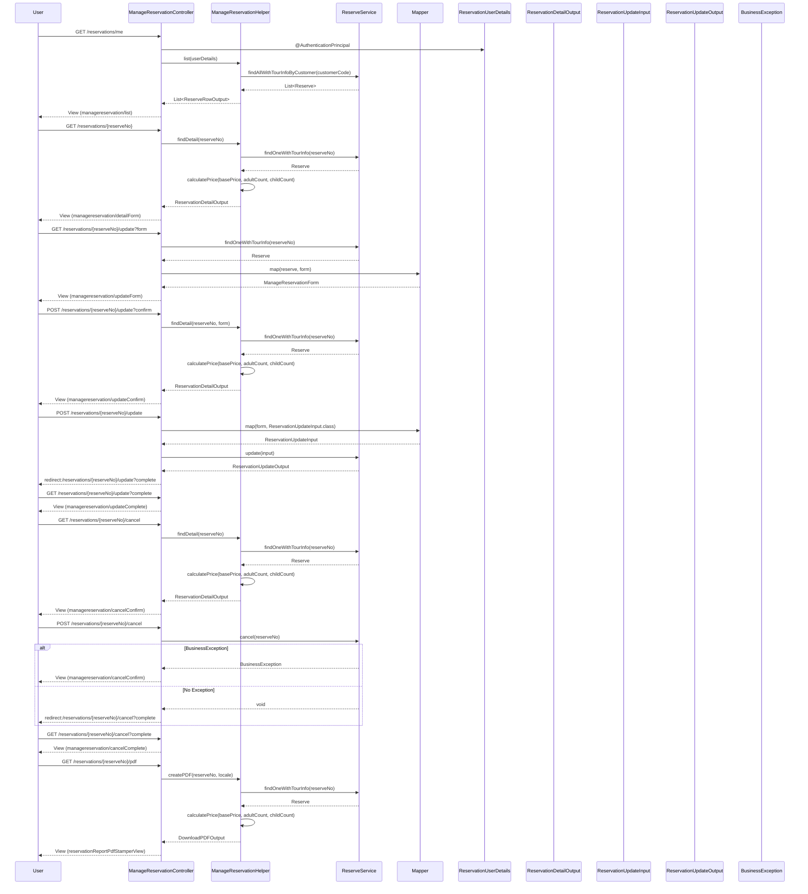

```mermaid
sequenceDiagram
    participant User
    participant ManageReservationController
    participant ManageReservationHelper
    participant ReserveService
    participant Mapper
    participant ReservationUserDetails
    participant ReservationDetailOutput
    participant ReservationUpdateInput
    participant ReservationUpdateOutput
    participant BusinessException

    User->>ManageReservationController: GET /reservations/me
    ManageReservationController->>ReservationUserDetails: @AuthenticationPrincipal
    ManageReservationController->>ManageReservationHelper: list(userDetails)
    ManageReservationHelper->>ReserveService: findAllWithTourInfoByCustomer(customerCode)
    ReserveService-->>ManageReservationHelper: List<Reserve>
    ManageReservationHelper-->>ManageReservationController: List<ReserveRowOutput>
    ManageReservationController-->>User: View (managereservation/list)

    User->>ManageReservationController: GET /reservations/{reserveNo}
    ManageReservationController->>ManageReservationHelper: findDetail(reserveNo)
    ManageReservationHelper->>ReserveService: findOneWithTourInfo(reserveNo)
    ReserveService-->>ManageReservationHelper: Reserve
    ManageReservationHelper->>ManageReservationHelper: calculatePrice(basePrice, adultCount, childCount)
    ManageReservationHelper-->>ManageReservationController: ReservationDetailOutput
    ManageReservationController-->>User: View (managereservation/detailForm)

    User->>ManageReservationController: GET /reservations/{reserveNo}/update?form
    ManageReservationController->>ReserveService: findOneWithTourInfo(reserveNo)
    ReserveService-->>ManageReservationController: Reserve
    ManageReservationController->>Mapper: map(reserve, form)
    Mapper-->>ManageReservationController: ManageReservationForm
    ManageReservationController-->>User: View (managereservation/updateForm)

    User->>ManageReservationController: POST /reservations/{reserveNo}/update?confirm
    ManageReservationController->>ManageReservationHelper: findDetail(reserveNo, form)
    ManageReservationHelper->>ReserveService: findOneWithTourInfo(reserveNo)
    ReserveService-->>ManageReservationHelper: Reserve
    ManageReservationHelper->>ManageReservationHelper: calculatePrice(basePrice, adultCount, childCount)
    ManageReservationHelper-->>ManageReservationController: ReservationDetailOutput
    ManageReservationController-->>User: View (managereservation/updateConfirm)

    User->>ManageReservationController: POST /reservations/{reserveNo}/update
    ManageReservationController->>Mapper: map(form, ReservationUpdateInput.class)
    Mapper-->>ManageReservationController: ReservationUpdateInput
    ManageReservationController->>ReserveService: update(input)
    ReserveService-->>ManageReservationController: ReservationUpdateOutput
    ManageReservationController-->>User: redirect:/reservations/{reserveNo}/update?complete

    User->>ManageReservationController: GET /reservations/{reserveNo}/update?complete
    ManageReservationController-->>User: View (managereservation/updateComplete)

    User->>ManageReservationController: GET /reservations/{reserveNo}/cancel
    ManageReservationController->>ManageReservationHelper: findDetail(reserveNo)
    ManageReservationHelper->>ReserveService: findOneWithTourInfo(reserveNo)
    ReserveService-->>ManageReservationHelper: Reserve
    ManageReservationHelper->>ManageReservationHelper: calculatePrice(basePrice, adultCount, childCount)
    ManageReservationHelper-->>ManageReservationController: ReservationDetailOutput
    ManageReservationController-->>User: View (managereservation/cancelConfirm)

    User->>ManageReservationController: POST /reservations/{reserveNo}/cancel
    ManageReservationController->>ReserveService: cancel(reserveNo)
    alt BusinessException
        ReserveService-->>ManageReservationController: BusinessException
        ManageReservationController-->>User: View (managereservation/cancelConfirm)
    else No Exception
        ReserveService-->>ManageReservationController: void
        ManageReservationController-->>User: redirect:/reservations/{reserveNo}/cancel?complete
    end

    User->>ManageReservationController: GET /reservations/{reserveNo}/cancel?complete
    ManageReservationController-->>User: View (managereservation/cancelComplete)

    User->>ManageReservationController: GET /reservations/{reserveNo}/pdf
    ManageReservationController->>ManageReservationHelper: createPDF(reserveNo, locale)
    ManageReservationHelper->>ReserveService: findOneWithTourInfo(reserveNo)
    ReserveService-->>ManageReservationHelper: Reserve
    ManageReservationHelper->>ManageReservationHelper: calculatePrice(basePrice, adultCount, childCount)
    ManageReservationHelper-->>ManageReservationController: DownloadPDFOutput
    ManageReservationController-->>User: View (reservationReportPdfStamperView)
```
